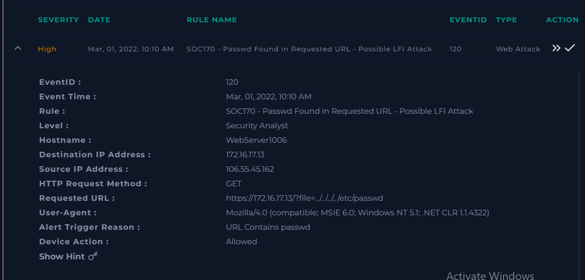
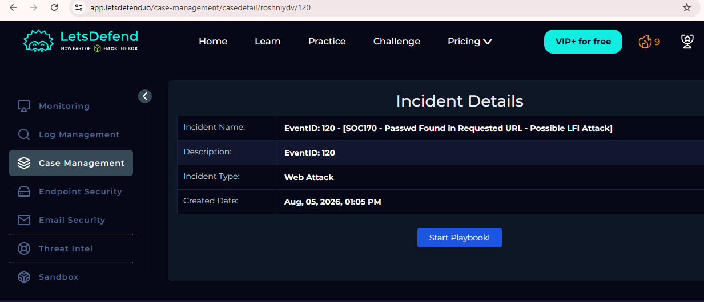
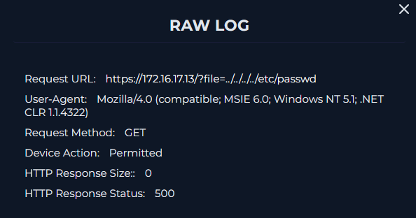
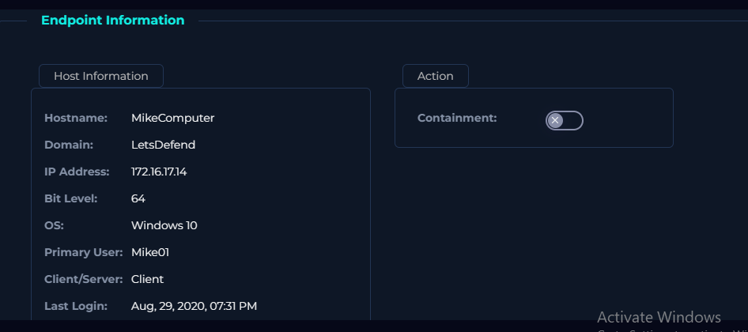
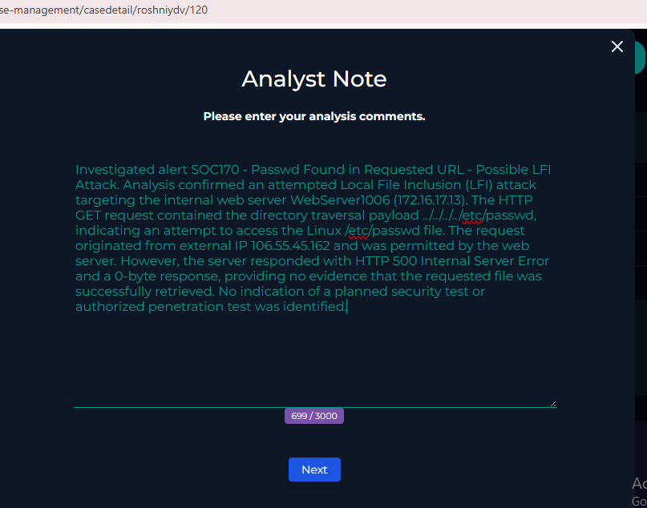
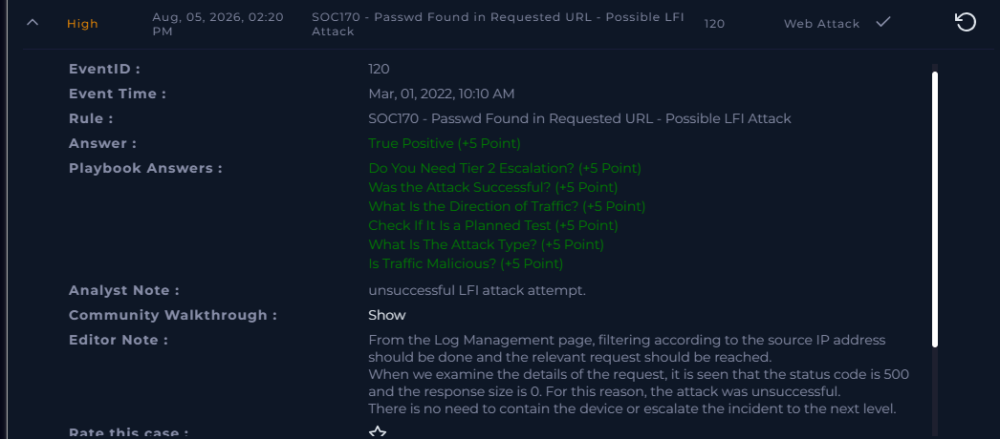

# SOC170 - Local File Inclusion (LFI) Attack Investigation

## Overview

This project documents the investigation of a Local File Inclusion (LFI) attack performed in the LetsDefend SOC Analyst platform.

The investigation involved analyzing HTTP traffic, identifying malicious payloads, determining whether the attack was successful, verifying whether it was part of a planned security test, and documenting the final incident response.

---

# Incident Summary

| Field | Value |
|-------|-------|
| Platform | LetsDefend |
| Alert Rule | SOC170 - Passwd Found in Requested URL - Possible LFI Attack |
| Incident Type | Web Attack |
| Severity | High |
| Attack Type | Local File Inclusion (LFI) |
| Verdict | True Positive |
| Attack Successful | No |

---

# Investigation Process

## Step 1 – Review Alert

The alert indicated that the requested URL contained the string **passwd**, which commonly appears in Local File Inclusion attacks targeting Linux systems.

**Evidence**



---

## Step 2 – Review Incident Details

The investigation identified:

- Source IP: **106.55.45.162**
- Destination IP: **172.16.17.13**
- HTTP Method: GET

The request targeted an internal web server.

**Evidence**



---

## Step 3 – Analyze HTTP Request

The HTTP request contained the payload:

```text
../../../../etc/passwd
```

This payload attempts directory traversal to access the Linux `/etc/passwd` file.

HTTP analysis:

- Device Action: Permitted
- Response Status: 500 Internal Server Error
- Response Size: 0 Bytes

The request reached the server, but there was no evidence that the requested file was returned.

**Evidence**



---

## Step 4 – Review Endpoint Information

The destination asset was reviewed to identify the targeted endpoint.

Hostname: **MikeComputer**

Operating System: Windows 10

This step confirmed the endpoint information associated with the investigation.

**Evidence**



---

# Findings

## Attack Type

Local File Inclusion (LFI)

---

## Malicious Payload

```text
../../../../etc/passwd
```

---

## Indicators of Compromise (IOCs)

| IOC | Value |
|------|------|
| Source IP | 106.55.45.162 |
| Destination IP | 172.16.17.13 |
| HTTP Method | GET |
| Target File | /etc/passwd |

---

## Attack Analysis

The attacker attempted to exploit a Local File Inclusion vulnerability by using directory traversal (`../../../../`) to access the Linux `/etc/passwd` file.

Although the request reached the web server, the server returned:

- HTTP Status: **500**
- Response Size: **0 Bytes**

No evidence indicated that the requested file was disclosed.


---

# Root Cause

The web application accepted user-controlled input through the `file` parameter without properly validating it, allowing an LFI attempt.

---

# Conclusion

The investigation confirmed a **True Positive Local File Inclusion (LFI) attack attempt**. The malicious request targeted the internal web server using the payload `../../../../etc/passwd`. Although the request was permitted, the server returned **HTTP 500 Internal Server Error** with a **0-byte response**, indicating that there is no evidence the sensitive file was successfully accessed. The attack was determined to be unsuccessful.

