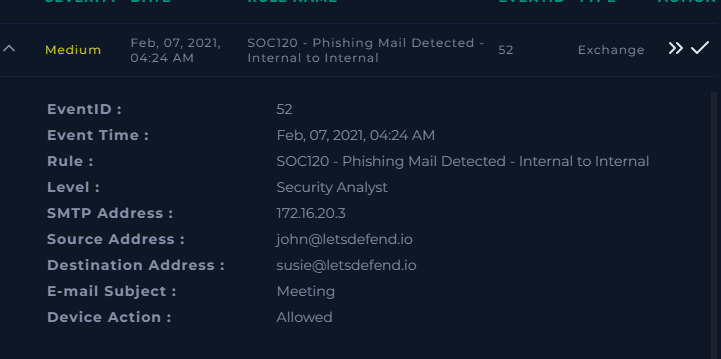
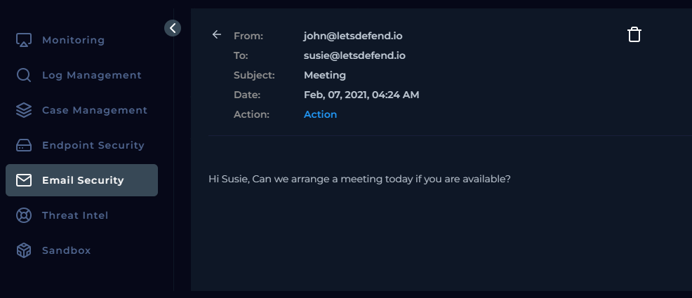
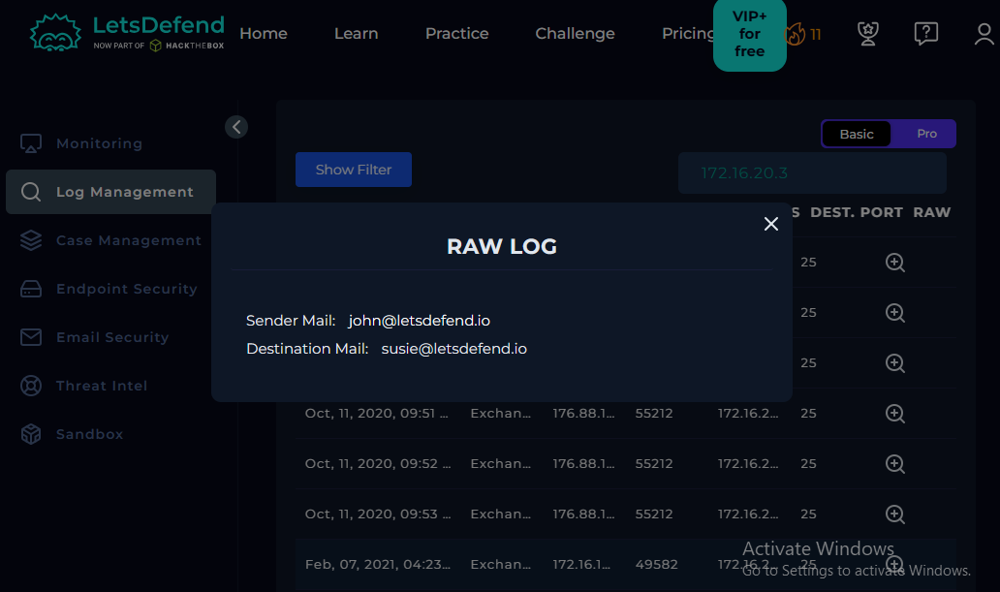

# Investigation Report

## Incident Information

| Field | Value |
|-------|-------|
| Incident Name | SOC120 - Phishing Mail Detected - Internal to Internal |
| Event ID | 52 |
| Severity | Medium |
| Event Type | Exchange |
| Event Time | Feb 07, 2021 - 04:24 AM |
| SMTP IP | 172.16.20.3 |
| Sender | john@letsdefend.io |
| Recipient | susie@letsdefend.io |
| Email Subject | Meeting |
| Device Action | Allowed |

---

# Incident Summary

A medium-severity alert was generated for a suspected **Internal-to-Internal Phishing Email**. The investigation aimed to determine whether the email was a phishing attempt or a legitimate internal business communication.

---

# Investigation Process

## Step 1 - Alert Review

The alert details were reviewed to identify the sender, recipient, SMTP address, subject, and device action.

### Evidence Collected

| Evidence | Value |
|----------|-------|
| Event ID | 52 |
| SMTP Address | 172.16.20.3 |
| Sender | john@letsdefend.io |
| Recipient | susie@letsdefend.io |
| Subject | Meeting |
| Device Action | Allowed |

**Screenshot**

---

## Step 2 - Email Security Analysis

The email was examined through the Email Security module.

### Email Metadata

**From**

john@letsdefend.io

**To**

susie@letsdefend.io

**Subject**

Meeting

**Email Content**

> Hi Susie,
>
> Can we arrange a meeting today if you are available?

### Findings

- No malicious attachments
- No URLs present
- Email appeared to be a normal internal communication

**Screenshot**

---

## Step 3 - Endpoint Investigation

The recipient endpoint was investigated to identify any user interaction or suspicious activity.

### Findings

- No browser history related to the email
- No malicious process execution
- No suspicious downloads
- No evidence of phishing execution

---

## Step 4 - Threat Intelligence

The available indicators were searched in the Threat Intelligence module.

### Findings

- No malicious reputation found
- No IOC matches
- No indicators associated with known phishing campaigns

---

## Step 5 - Log Monitoring

Exchange logs were reviewed.

### Evidence

| Field | Value |
|-------|-------|
| Sender Email | john@letsdefend.io |
| Recipient Email | susie@letsdefend.io |

### Findings

Only normal email communication between the sender and recipient was observed. No suspicious log events were identified.

**Screenshot**

---

# Extracted Artifacts

| Artifact Type | Value |
|--------------|-------|
| SMTP IP | 172.16.20.3 |
| Sender Email | john@letsdefend.io |
| Recipient Email | susie@letsdefend.io |
| Email Subject | Meeting |

---

# Analyst Notes

Reviewed the email metadata, including the sender, recipient, SMTP IP, and subject. The email content was a legitimate internal meeting request containing no malicious URLs or attachments. Endpoint investigation revealed no suspicious browser activity or process execution. Threat Intelligence searches returned no malicious indicators, and Log Monitoring only showed normal email communication between the sender and recipient. Based on the investigation, no evidence of phishing activity was identified.

---

# Final Verdict

**Classification:** False Positive

### Reason

- Internal sender and recipient
- No attachments
- No URLs
- No suspicious endpoint activity
- No malicious threat intelligence results
- No suspicious log events
- Email content was a legitimate meeting request

---

# Skills Demonstrated

- Email Security Analysis
- Email Investigation
- Endpoint Investigation
- Threat Intelligence Validation
- Log Monitoring
- Indicator Analysis
- Incident Response
- False Positive Analysis
- Security Documentation
