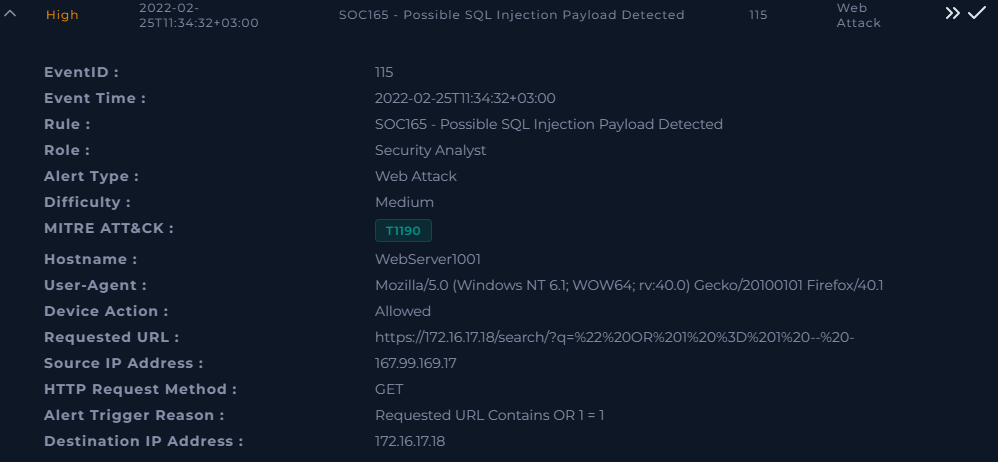
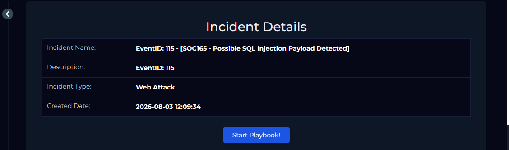
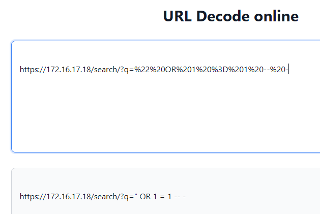
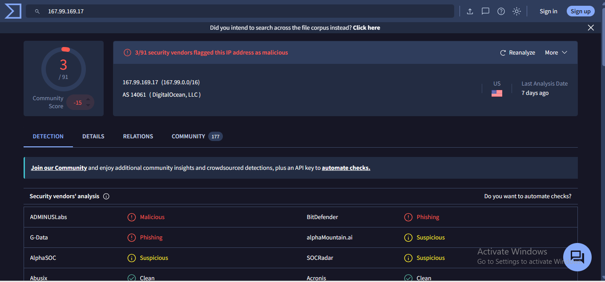
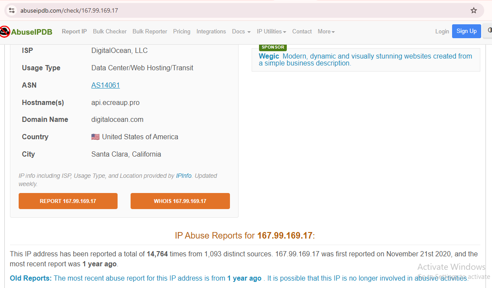
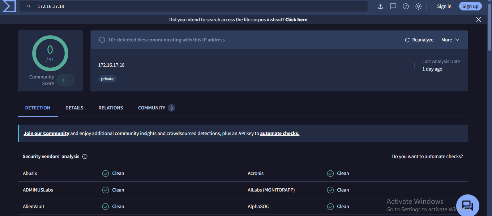

# SOC165 - Possible SQL Injection Payload Detected

## 1. Alert Overview

| Field              | Details                                          |
| ------------------ | ------------------------------------------------ |
| **Platform**       | LetsDefend                                       |
| **Alert ID**       | 115                                              |
| **Detection Rule** | SOC165 - Possible SQL Injection Payload Detected |
| **Severity**       | High                                             |
| **Alert Type**     | Web Attack                                       |
| **Difficulty**     | Medium                                           |
| **MITRE ATT&CK**   | T1190 - Exploit Public-Facing Application        |
| **Hostname**       | WebServer1001                                    |
| **Source IP**      | `167.99.169.17`                                  |
| **Destination IP** | `172.16.17.18`                                   |
| **HTTP Method**    | GET                                              |
| **Device Action**  | Allowed                                          |

### Alert Details



### Incident Details



---

# 2. Initial Analysis

The alert was triggered because the requested URL contained the SQL Injection indicator:

```text
OR 1=1
```

The traffic originated from the external IP `167.99.169.17` and targeted the internal web server `172.16.17.18` (`WebServer1001`).

The initial attack path was:

```text
External Source
      |
      | HTTP GET
      v
167.99.169.17
      |
      | SQL Injection Payload
      v
172.16.17.18
      |
      v
WebServer1001
      |
      v
/search/?q=...
```

The first objective was to determine whether this was an actual SQL Injection attempt, whether it was part of an authorized test, and whether exploitation was successful.

---

# 3. URL Analysis and SQL Injection Identification

The requested URL from the alert was:

```text
https://172.16.17.18/search/?q=%22%20OR%201%20%3D%201%20--%20-
```

The URL was decoded to reveal the actual payload:

```text
" OR 1 = 1 -- -
```

The decoded payload contains SQL Injection syntax and attempts to manipulate the logic of a backend SQL query.

### Finding

**SQL Injection activity was confirmed from the requested URL.**



---

# 4. Source IP Investigation

The source IP identified in the alert was:

```text
167.99.169.17
```

The IP was investigated using threat-intelligence sources to identify its ownership and reputation.

## VirusTotal

VirusTotal showed:

* **3 / 91 security vendors** flagged the IP as malicious.
* **ASN:** AS14061
* **Organization:** DigitalOcean, LLC
* **Country:** United States



### Interpretation

The IP belongs to a cloud/data-center provider. Cloud infrastructure can be used for legitimate services as well as scanning and attack activity.

The reputation result was therefore treated as **supporting evidence**, not as proof by itself.

---

## AbuseIPDB

AbuseIPDB identified:

* **ISP:** DigitalOcean, LLC
* **Usage Type:** Data Center/Web Hosting/Transit
* **ASN:** AS14061
* **Hostname:** `api.ecreaup.pro`
* **Country:** United States

The IP also had a significant history of abuse reports.



### Finding

The source IP belongs to hosting infrastructure and has a history of reported abuse. This increases the suspicion when correlated with the observed SQL Injection activity.

---

# 5. Destination Host Investigation

The destination IP was:

```text
172.16.17.18
```

This is a private/internal IP address in the LetsDefend environment.



The destination was mapped to the following endpoint:

| Field            | Value                 |
| ---------------- | --------------------- |
| **Hostname**     | `WebServer1001`       |
| **Domain**       | `letsdefend.local`    |
| **IP Address**   | `172.16.17.18`        |
| **OS**           | Windows Server 2019   |
| **Primary User** | `webadmin`            |
| **Last Login**   | `2022-02-11 01:42:46` |


### Finding

The SQL Injection traffic was targeting the internal web server:

```text
172.16.17.18
      ↓
WebServer1001
      ↓
Windows Server 2019
```

---

# 6. Log Management Investigation

The source IP `167.99.169.17` was used as a filter in Log Management to identify other activity from the same source.

### Why?

A single alert may represent only one event in a larger attack sequence.

Pivoting on the source IP allows the analyst to determine:

* Whether the source made additional requests.
* Whether the activity was isolated.
* What requests occurred before and after the alert.
* Whether the attacker was performing multiple SQL Injection attempts.

Multiple requests from the same source were identified.


---

# 7. Attack Timeline

The observed activity showed a progression from a normal request to SQL Injection testing.

The relevant sequence was:

```text
GET /
   ↓
Input testing
   ↓
SQL Injection payload
   ↓
Additional SQL Injection requests
```

The source IP therefore did not make only one isolated suspicious request. Multiple related requests were observed against the `/search` endpoint.

### Finding

The sequence of requests is consistent with deliberate SQL Injection testing.

---

# 8. HTTP Response Analysis

The HTTP responses were then examined to determine whether the SQL Injection attempts were successful.

### Normal Request

For the normal:

```text
GET /
```

the server returned:

```text
HTTP Response Status: 200
HTTP Response Size: 3547
```


### SQL Injection Request

For the SQL Injection request, the server returned:

```text
HTTP Response Status: 500
HTTP Response Size: 948
```


---

# 9. Response Comparison and Exploitation Assessment

The SQL Injection requests were compared with the normal request.

| Request                      | HTTP Status |      Response Size |
| ---------------------------- | ----------: | -----------------: |
| Normal `GET /`               |       `200` |             `3547` |
| SQL Injection request        |       `500` |              `948` |
| Other SQL Injection requests |       `500` | Same response size |

The SQL Injection requests consistently returned an HTTP `500` response with the same response size.

This indicates that the application was returning an error when processing the malicious requests.

No evidence was identified showing:

* Successful SQL query manipulation
* Database data disclosure
* Authentication bypass
* Successful exploitation
* Compromise of the web server

### Finding

**The SQL Injection attempt was unsuccessful.**

> The HTTP 500 response and consistent response size were considered together with the payload and related requests. A 500 response alone does not universally prove that SQL Injection failed.

---

# 10. Planned Test / False Positive Check

Because authorized penetration tests and attack-simulation platforms can generate malicious-looking traffic, the activity was checked to determine whether it was part of a planned test.

The investigation included checking for:

* Emails related to the source IP.
* Emails related to the targeted host.
* Planned penetration-testing activity.
* Attack simulation infrastructure such as AttackIQ, Picus, or Verodin.

No evidence of an authorized penetration test or planned attack simulation was found.

### Finding

**The activity was not identified as a planned security test.**

---

# 11. Final Investigation Findings

| Investigation Area          | Finding                                   |
| --------------------------- | ----------------------------------------- |
| **Payload**                 | SQL Injection payload identified          |
| **Source IP**               | `167.99.169.17`                           |
| **Source Infrastructure**   | DigitalOcean / Data Center                |
| **Target**                  | `WebServer1001`                           |
| **Target IP**               | `172.16.17.18`                            |
| **Attack Pattern**          | Multiple related SQL Injection requests   |
| **HTTP Response**           | `500` for SQL Injection requests          |
| **Response Size**           | Consistent across SQL Injection responses |
| **Planned Test**            | No evidence found                         |
| **Successful Exploitation** | No evidence                               |
| **Compromise**              | No evidence                               |

---

# 12. Final Verdict

## 🔴 Malicious SQL Injection Attempt — Unsuccessful

The investigation confirmed that the external source `167.99.169.17` sent a SQL Injection payload to `WebServer1001`.

URL decoding identified the payload:

```text
" OR 1 = 1 -- -
```

Log Management analysis showed multiple related requests from the same source, demonstrating a sequence of SQL Injection testing.

The SQL Injection requests consistently returned HTTP `500` responses with the same response size, and no evidence of successful exploitation, data disclosure, authentication bypass, or server compromise was identified.

No evidence of an authorized penetration test or planned attack simulation was found.

### Final Classification

```text
Malicious Activity:        YES
SQL Injection Attempt:     YES
Planned Test:              NO EVIDENCE
Successful Exploitation:   NO
Compromise:                NO EVIDENCE
```

---

# 13. MITRE ATT&CK

**T1190 - Exploit Public-Facing Application**

The alert was mapped by LetsDefend to T1190 because the attacker attempted to exploit a web-facing application through a crafted HTTP request.

---

# 14. Investigation Workflow

The investigation followed this workflow:

```text
Alert Review
    ↓
Identify Source & Destination
    ↓
Inspect Requested URL
    ↓
Decode URL
    ↓
Confirm SQL Injection Payload
    ↓
Pivot on Source IP in Log Management
    ↓
Review Related Requests
    ↓
Build Attack Timeline
    ↓
Analyze HTTP Responses
    ↓
Compare Response Status & Size
    ↓
Investigate Source IP Reputation
    ↓
Identify Target Endpoint
    ↓
Check for Planned Security Testing
    ↓
Assess Exploitation
    ↓
Determine Final Verdict
```
