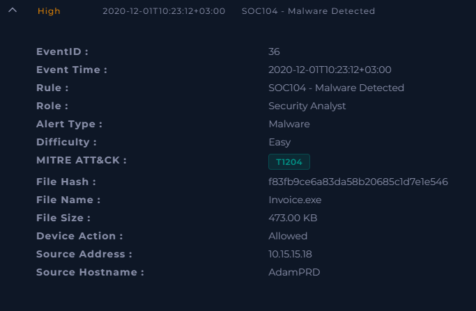
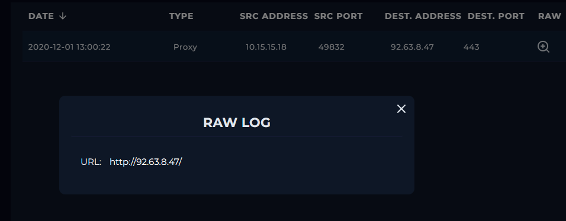
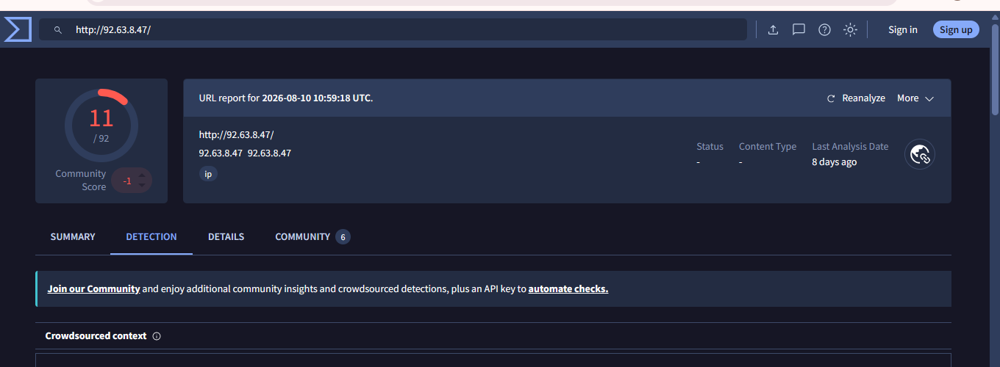
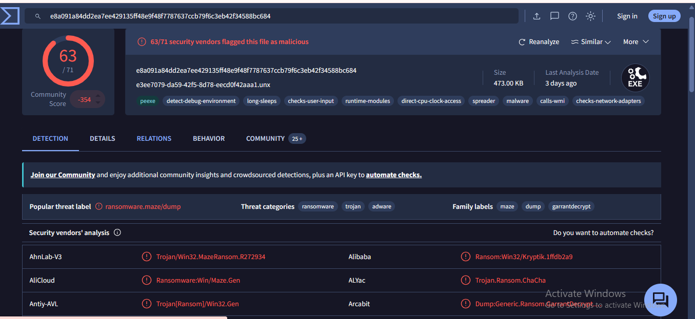
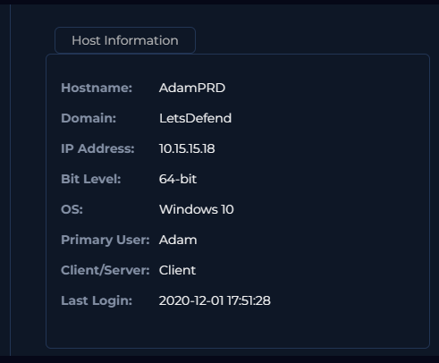
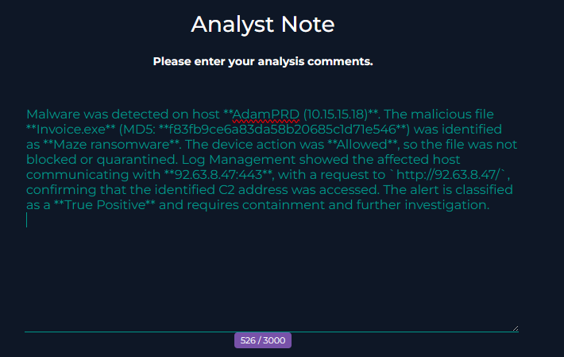

# 🔴 SOC104 – Malware Detected | LetsDefend SOC Investigation

## 1. Investigation Overview

| Field              | Details                    |
| ------------------ | -------------------------- |
| **Platform**       | LetsDefend                 |
| **Event ID**       | 36                         |
| **Detection Rule** | SOC104 – Malware Detected  |
| **Severity**       | High                       |
| **Alert Type**     | Malware                    |
| **MITRE ATT&CK**   | T1204 – User Execution     |
| **Event Time**     | 2020-12-01 10:23:12 +03:00 |
| **Hostname**       | AdamPRD                    |
| **Source IP**      | 10.15.15.18                |
| **Detected File**  | Invoice.exe                |
| **File Size**      | 473 KB                     |
| **Device Action**  | Allowed                    |

---

## 2. Initial Alert Triage

A **High-severity SOC104 – Malware Detected** alert was generated for the Windows endpoint **AdamPRD (10.15.15.18)**.

The alert identified the following indicators:

* **File:** `Invoice.exe`
* **File Size:** `473 KB`
* **MD5:** `f83fb9ce6a83da58b20685c1d71e546`
* **Device Action:** `Allowed`



### Initial Assessment

The security control detected the executable but recorded the action as **Allowed**, indicating that the file was not blocked or quarantined at the time of detection.

Further investigation was required to validate the file and determine whether the endpoint showed additional signs of compromise.

---

## 3. Investigation

### 3.1 Threat Indicator

The LetsDefend playbook classified the threat indicator as:

**Other**

The initial detection was based on a malicious file rather than evidence specifically indicating an unauthorized startup service, disabled antivirus, or another predefined indicator category.

---

### 3.2 Malware Analysis

The file hash was submitted to **VirusTotal** for validation.

```text
f83fb9ce6a83da58b20685c1d71e546
```

VirusTotal reported:

```text
63 / 71 security vendors flagged this file as malicious
```

The sample was associated with:

* **Maze ransomware**
* Ransomware
* Trojan
* Malware

The popular threat label was:

```text
ransomware.maze/dump
```


### Finding

The VirusTotal results provided strong evidence that **`Invoice.exe` is malicious and associated with the Maze ransomware family**.

This validated the original malware detection as a genuine security event.

---

### 3.3 Network Investigation

The affected host was then investigated in **LetsDefend Log Management** for network activity.

A proxy event was identified:

| Field                   | Value               |
| ----------------------- | ------------------- |
| **Date**                | 2020-12-01 13:00:22 |
| **Type**                | Proxy               |
| **Source Address**      | 10.15.15.18         |
| **Source Port**         | 49832               |
| **Destination Address** | 92.63.8.47          |
| **Destination Port**    | 443                 |



The raw log contained:

```text
URL: http://92.63.8.47/
```

This confirms that **AdamPRD (10.15.15.18)** made an outbound request to **92.63.8.47:443**.

> A public IP address alone does not prove malicious activity. The network event establishes the communication; the C2 classification comes from the malware investigation context.

---

### 3.4 C2 Access Verification

The identified C2 address for the investigation was:

```text
92.63.8.47
```

The observed network communication was:

```text
10.15.15.18
      |
      | Outbound request
      ↓
92.63.8.47:443
```

The C2 address was searched in Log Management, and the proxy event confirmed that the affected endpoint had accessed the address.

**C2 Access: Accessed ✅**

This provides network evidence that the affected endpoint communicated with the identified C2 infrastructure.

---

### 3.5 URL / Threat Intelligence Analysis

The associated URL was:

```text
http://92.63.8.47/
```



The URL/IP analysis was used as additional threat-intelligence context during the investigation.




### SOC Observation

An external IP should **not automatically be classified as malicious** simply because it is public.

The assessment was based on correlating:

```text
Malicious File
      +
Maze Ransomware Identification
      +
Affected Endpoint
      +
Network Communication
      +
Identified C2 Indicator
```

This correlation provides stronger evidence than relying on the IP address alone.

---

### 3.6 Endpoint Investigation

The affected endpoint information was reviewed:

| Field                | Value               |
| -------------------- | ------------------- |
| **Hostname**         | AdamPRD             |
| **Domain**           | LetsDefend          |
| **IP Address**       | 10.15.15.18         |
| **Operating System** | Windows 10          |
| **Architecture**     | 64-bit              |
| **Primary User**     | Adam                |
| **Client/Server**    | Client              |
| **Last Login**       | 2020-12-01 17:51:28 |



This confirms the affected asset as a **Windows 10 client** associated with user **Adam**.

---

## 4. Findings

The investigation established the following:

1. A **High-severity malware alert** was generated for `AdamPRD`.
2. The detected file was **`Invoice.exe`**.
3. The security control recorded the file action as **Allowed**.
4. The file hash was validated using VirusTotal.
5. **63/71 security vendors** flagged the sample as malicious.
6. The sample was associated with **Maze ransomware**.
7. The affected host `10.15.15.18` generated a proxy connection to `92.63.8.47:443`.
8. The raw log showed a request to `http://92.63.8.47/`.
9. The identified C2 address was confirmed as **accessed** by the affected endpoint.

---

## 5. Indicators of Compromise (IOCs)

| IOC Type           | Indicator                         |
| ------------------ | --------------------------------- |
| **Hostname**       | `AdamPRD`                         |
| **Internal IP**    | `10.15.15.18`                     |
| **Malicious File** | `Invoice.exe`                     |
| **MD5 Hash**       | `f83fb9ce6a83da58b20685c1d71e546` |
| **C2 IP**          | `92.63.8.47`                      |
| **C2 URL**         | `http://92.63.8.47/`              |

These indicators can be used for additional threat hunting across the environment.

---

## 6. MITRE ATT&CK

### T1204 – User Execution

The alert was mapped to **T1204 – User Execution**.

This technique covers scenarios where a user is required to execute or interact with malicious content.

---

## 7. Verdict

### 🔴 True Positive — Malware / Ransomware

The alert was classified as a **True Positive**.

The detected `Invoice.exe` file was validated as malicious and associated with **Maze ransomware**. The affected endpoint also communicated with the identified C2 address.

Because the malicious file was **Allowed**, the endpoint should be treated as potentially compromised and investigated/contained according to the incident-response process.

---

## 8. Recommended Response

Recommended SOC response actions:

* **Isolate** the affected endpoint from the network.
* Prevent further communication with the identified C2 infrastructure.
* Quarantine or remove the malicious file.
* Investigate the endpoint for additional malicious activity.
* Check for persistence mechanisms.
* Search other endpoints for the same file hash.
* Hunt for additional communication with `92.63.8.47`.
* Assess whether ransomware activity affected other files or systems.
* Escalate the incident according to the incident-response procedure.

---

## 9. Analyst Note

The final investigation findings were documented in the LetsDefend Analyst Note.



### Final Assessment

The evidence supports a **True Positive malware infection** involving a malicious `Invoice.exe` sample associated with Maze ransomware. The affected endpoint also accessed the identified C2 address, requiring containment and further investigation.

---

## 10. Investigation Workflow

```text
Alert Received
      ↓
Initial Alert Triage
      ↓
Extract File & Host IOCs
      ↓
Analyze File Hash
      ↓
Validate Malware
      ↓
Identify C2 Indicator
      ↓
Search C2 in Log Management
      ↓
Confirm C2 Access
      ↓
Determine True Positive
      ↓
Contain & Escalate
      ↓
Document Findings
```

---

**Conclusion:**

> The identified C2 address was accessed by the affected endpoint.

This helps prevent unsupported conclusions during incident investigation.

---

## 11. Investigation Summary

**SOC104 – Malware Detected (Event 36)** was investigated on the Windows endpoint **AdamPRD (10.15.15.18)**. The detected `Invoice.exe` sample was confirmed malicious through VirusTotal analysis and associated with **Maze ransomware**. The file was allowed by the security control. Log Management showed the affected endpoint communicating with **92.63.8.47:443**, and the investigation confirmed that the identified C2 address was accessed. The alert was classified as a **True Positive** requiring containment and further investigation.

---

### Evidence Collected

| Evidence                 | Purpose                                 |
| ------------------------ | --------------------------------------- |
| SOC104 Alert             | Initial detection and affected endpoint |
| VirusTotal File Analysis | Malware validation                      |
| Proxy Log                | Network communication evidence          |
| URL Analysis             | Threat-intelligence context             |
| Endpoint Information     | Host and user context                   |
| Analyst Note             | Final investigation documentation       |
