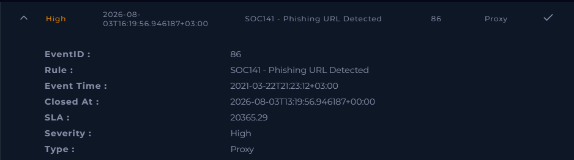
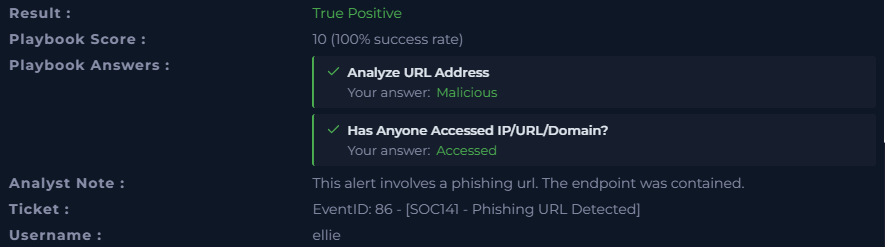

# 🔴 Phishing URL Detected — SOC Investigation | LetsDefend

## 📌 Alert Overview

**Event ID:** 86
**Rule:** SOC141 - Phishing URL Detected
**Event Time:** 2021-03-22 21:23:12 +03:00
**Severity:** High
**Alert Type:** Proxy
**Role:** Security Analyst
**Difficulty:** Beginner
**Result:** ✅ True Positive
**Playbook Score:** 10/10 (100% Success Rate)

---

## 🎯 Investigation Objective

The objective of this investigation was to determine whether the detected URL was malicious, verify whether the URL/domain had been accessed, and assess the potential impact on the affected endpoint.

---

## 🔎 Investigation Details

### 1️⃣ Analyze URL Address

**Request URL:**

`http://mogagrocol.ru/wp-content/plugins/akismet/fv/index.php?email=ellie@letsdefend.io`

The URL was identified as **malicious**.

The URL contains a suspicious path:

`/wp-content/plugins/akismet/fv/index.php`

and includes the user's email address as a parameter:

`email=ellie@letsdefend.io`

This behavior is consistent with a **phishing URL**, where an attacker may attempt to redirect a user to a malicious page or collect information.

**Verdict:** 🚨 **Malicious URL**

---

### 2️⃣ Check Whether the URL Was Accessed

The investigation confirmed that the destination **IP/URL/domain was accessed**.

**Access Status:** ✅ Accessed

This increased the risk associated with the alert because the endpoint had communicated with the malicious destination.

---

## 🌐 Network Indicators

| Indicator                | Value                                                                                    |
| ------------------------ | ---------------------------------------------------------------------------------------- |
| **Source IP**            | `172.16.17.49`                                                                           |
| **Source Hostname**      | `EmilyComp`                                                                              |
| **Destination IP**       | `91.189.114.8`                                                                           |
| **Destination Hostname** | `mogagrocol.ru`                                                                          |
| **Request URL**          | `http://mogagrocol.ru/wp-content/plugins/akismet/fv/index.php?email=ellie@letsdefend.io` |
| **Device Action**        | Allowed                                                                                  |

---

## 👤 User & Endpoint Information

**Username:** `ellie`

**Hostname:** `EmilyComp`

**User Agent:**

`Mozilla/5.0 (Windows NT 6.1; Win64; x64) AppleWebKit/537.36 (KHTML, like Gecko) Chrome/79.0.3945.88 Safari/537.36`

The user agent indicates that the request originated from a **Windows endpoint using Google Chrome**.

---

## 🚨 Analyst Assessment

The alert was determined to be a **True Positive**.

The requested URL was identified as malicious and the destination had been accessed from the affected endpoint. The presence of the user's email address within the URL parameter further supported the phishing nature of the request.

The endpoint was subsequently **contained** to prevent further communication with the malicious destination and reduce the possibility of additional compromise.

---

## 🛡️ Response / Mitigation

The following action was taken:

* ✅ Confirmed the URL as malicious
* ✅ Confirmed that the malicious URL/domain was accessed
* ✅ Identified the affected user and endpoint
* ✅ Identified the source and destination IP addresses
* ✅ Contained the affected endpoint
* ✅ Classified the alert as **True Positive**

---

## 📊 Playbook Results

**Analyze URL Address:**
➡️ Malicious

**Has Anyone Accessed IP/URL/Domain?**
➡️ Accessed

---

## 📝 Analyst Note

> This alert involved a phishing URL. The endpoint was contained.

---

## 🧠 MITRE ATT&CK Relevance

This type of activity can be associated with:

**T1566 — Phishing**

Phishing is commonly used by threat actors to trick users into interacting with malicious links, websites, or content.

---

## 📌 Final Verdict

**Alert:** SOC141 - Phishing URL Detected
**Classification:** 🔴 **True Positive**
**Severity:** High
**URL:** Malicious
**URL Accessed:** Yes
**Endpoint:** `EmilyComp`
**User:** `ellie`
**Response:** Endpoint contained

---

## 🔐 Conclusion

This investigation demonstrated the importance of validating suspicious URLs and determining whether the destination was actually accessed.

The URL was confirmed to be **malicious**, and because the endpoint had accessed the destination, the alert was classified as a **True Positive**. Containing the endpoint was an appropriate response to limit potential further communication with the malicious infrastructure.

Another practical SOC investigation completed through **LetsDefend**, strengthening my skills in **phishing analysis, proxy alert investigation, IOC identification, incident validation, and endpoint containment**.

#CyberSecurity #SOC #SOCAnalyst #LetsDefend #Phishing #PhishingAttack #ThreatDetection #IncidentResponse #BlueTeam #CyberDefense #SecurityOperations #SOCInvestigation #DFIR #MITREATTACK #CyberSecurityJourney
