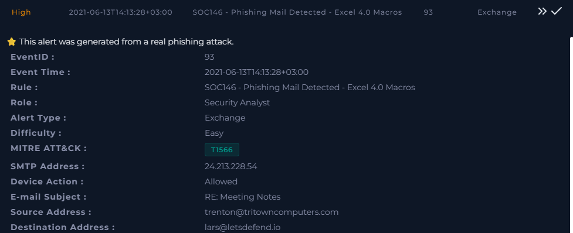
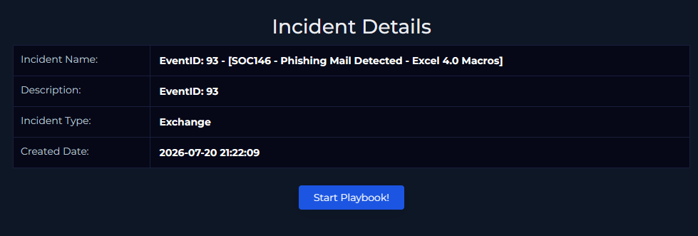
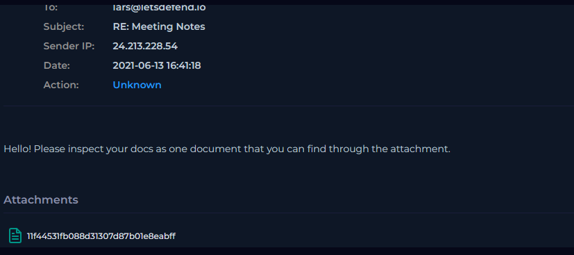
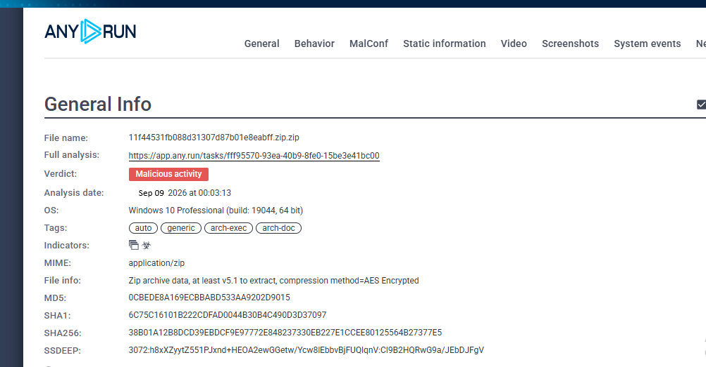

# 🛡️ Investigation 08 – Phishing Mail Detected: Excel 4.0 Macros

## 📋 Incident Overview

| Field | Details |
|---|---|
| **Platform** | Let'sDefend |
| **Event ID** | 93 |
| **Alert Rule** | SOC146 - Phishing Mail Detected - Excel 4.0 Macros |
| **Severity** | High |
| **Alert Type** | Exchange |
| **Difficulty** | Easy |
| **Role** | Security Analyst |
| **MITRE ATT&CK** | T1566 - Phishing |
| **Event Time** | 2021-06-13 14:13:28 +03:00 |
| **SMTP Address** | `24.213.228.54` |
| **Device Action** | Allowed |
| **Source Address** | `trenton@tritowncomputers.com` |
| **Destination Address** | `lars@letsdefend.io` |
| **Email Subject** | `RE: Meeting Notes` |

---

# 🚨 Alert Details

A **High-severity** Exchange alert was generated by the rule:

`SOC146 - Phishing Mail Detected - Excel 4.0 Macros`

The alert was associated with a phishing email containing an attachment.

The security control recorded the **Device Action as Allowed**, indicating that the email was permitted rather than blocked.

### Alert Information

- **Event ID:** `93`
- **Severity:** `High`
- **Alert Type:** `Exchange`
- **Rule:** `SOC146 - Phishing Mail Detected - Excel 4.0 Macros`
- **MITRE ATT&CK:** `T1566 - Phishing`
- **SMTP Address:** `24.213.228.54`
- **Device Action:** `Allowed`



---

# 🚨 Incident Details

The incident was generated as **Event ID 93** under the Exchange alert type.

### Incident

**Event ID:** `93`

**Incident Name:**

`[SOC146 - Phishing Mail Detected - Excel 4.0 Macros]`

**Incident Type:**

`Exchange`



---

# 📧 Email Analysis

## Email Details

The suspicious email contained the following information:

| Field | Value |
|---|---|
| **From** | `trenton@tritowncomputers.com` |
| **To** | `lars@letsdefend.io` |
| **Subject** | `RE: Meeting Notes` |
| **Sender IP** | `24.213.228.54` |
| **Device Action** | `Allowed` |

### Email Body

The email stated:

> "Hello! Please inspect your docs as one document that you can find through the attachment."

The message attempted to persuade the recipient to open and inspect the attached document.

### Initial Assessment

The combination of:

- Phishing-related alert rule
- Excel 4.0 macro detection
- Suspicious attachment
- Generic document-related lure

warranted further analysis of the attachment.



---

# 📎 Attachment Analysis

The email contained the following attachment:

`11f44531fb088d31307d87b01e8eabff`

The attachment was submitted to **ANY.RUN** for dynamic analysis.

### ANY.RUN Verdict

🔴 **Malicious activity**

The analyzed file was:

`11f44531fb088d31307d87b01e8eabff.zip.zip`

The archive was identified as an **AES-encrypted ZIP archive**.



---

# 🧪 File Information

| Attribute | Value |
|---|---|
| **File Name** | `11f44531fb088d31307d87b01e8eabff.zip.zip` |
| **MIME Type** | `application/zip` |
| **File Type** | ZIP Archive |
| **Encryption** | AES Encrypted |
| **MD5** | `0cbede8a169ecbbabd533aa9202d9015` |
| **SHA1** | `6C75C16101B222CDFAD0044B30B4C490D3D37097` |
| **SHA256** | `38B01A12B8DCD39EBDCF9E97772E848237330EB227E1CCEE80125564B27377E5` |
| **Sandbox Verdict** | Malicious activity |

---

# 🔬 Malware Execution Analysis

The sandbox recorded the following process activity:

```text
WinRAR.exe
    ↓
WinRAR.exe
    ↓
EXCEL.EXE
    ↓
regsvr32.exe
    ↓
iroto.dll
iroto1.dll

# 📝 Analyst Note

The alert was investigated as a High-severity phishing email detected by the rule **SOC146 - Phishing Mail Detected - Excel 4.0 Macros**.

The email was sent from `trenton@tritowncomputers.com` to `lars@letsdefend.io` with the subject **RE: Meeting Notes**. The email security control recorded the **Device Action as Allowed**, indicating that the message was permitted.

The attached file `11f44531fb088d31307d87b01e8eabff.zip.zip` was submitted to ANY.RUN for dynamic analysis. The sandbox classified the sample as **Malicious activity**. The archive contained the Excel file `research-1646684671.xls`, which was executed by `EXCEL.EXE`.

During execution, `regsvr32.exe` was observed loading `iroto.dll` and `iroto1.dll`, indicating suspicious DLL execution.

Network analysis also identified an outbound connection from `EXCEL.EXE` to:

`nws.visionconsulting.ro`  
`188.209.214.83:443`

This was treated as a **suspicious network IOC / potential C2 candidate**. The indicator was checked against the available Let'sDefend Log Management data, but no corresponding access event was identified. Therefore, C2 communication could not be confirmed from the available logs.

Based on the sandbox evidence and observed execution behavior, the attachment was confirmed to be malicious.

# 🔴 Final Output / Conclusion

## Verdict: TRUE POSITIVE – MALICIOUS PHISHING EMAIL

The investigation confirmed that the alert was a **True Positive**.

The phishing email was **allowed** by the email security control and contained a malicious encrypted ZIP attachment. Dynamic analysis in ANY.RUN confirmed **malicious activity**.

### Confirmed Findings

- 📧 **Phishing email:** Confirmed
- 📎 **Malicious attachment:** Confirmed
- 🦠 **Malicious activity:** Confirmed by ANY.RUN
- 📊 **Excel document execution:** Confirmed
- ⚙️ **`regsvr32.exe` execution:** Confirmed
- 🧩 **`iroto.dll` / `iroto1.dll` execution:** Confirmed
- 🌐 **Suspicious network connection:** Observed
- 🎯 **Suspicious IOC:** `188.209.214.83`
- 🌍 **Associated domain:** `nws.visionconsulting.ro`
- 🔎 **C2 access in Log Management:** Not observed / not confirmed

### Final Assessment

The evidence indicates that the recipient received an **active malicious phishing attachment** that executed successfully in the sandbox environment. The use of `EXCEL.EXE` followed by `regsvr32.exe` to load DLL files demonstrates malicious execution behavior.

Although `nws.visionconsulting.ro` (`188.209.214.83`) was observed as a suspicious external destination, there was **no corresponding event in the available Log Management data**. Therefore, it should not be reported as confirmed C2 communication.

### Final Classification

> **TRUE POSITIVE — MALICIOUS PHISHING EMAIL WITH MALICIOUS EXCEL ATTACHMENT**

The incident should be treated as a security incident requiring containment, removal of the malicious email/attachment, IOC hunting, and endpoint investigation.

# 🔴 Final Output / Conclusion

## Verdict: TRUE POSITIVE – MALICIOUS PHISHING EMAIL

The investigation confirmed that the alert was a **True Positive**.

The phishing email was **allowed** by the email security control and contained a malicious encrypted ZIP attachment. Dynamic analysis in ANY.RUN confirmed **malicious activity**.

### Confirmed Findings

- 📧 **Phishing email:** Confirmed
- 📎 **Malicious attachment:** Confirmed
- 🦠 **Malicious activity:** Confirmed by ANY.RUN
- 📊 **Excel document execution:** Confirmed
- ⚙️ **`regsvr32.exe` execution:** Confirmed
- 🧩 **`iroto.dll` / `iroto1.dll` execution:** Confirmed
- 🌐 **Suspicious network connection:** Observed
- 🎯 **Suspicious IOC:** `188.209.214.83`
- 🌍 **Associated domain:** `nws.visionconsulting.ro`
- 🔎 **C2 access in Log Management:** Not observed / not confirmed

### Final Assessment

The evidence indicates that the recipient received an **active malicious phishing attachment** that executed successfully in the sandbox environment. The use of `EXCEL.EXE` followed by `regsvr32.exe` to load DLL files demonstrates malicious execution behavior.

Although `nws.visionconsulting.ro` (`188.209.214.83`) was observed as a suspicious external destination, there was **no corresponding event in the available Log Management data**. Therefore, it should not be reported as confirmed C2 communication.

### Final Classification

> **TRUE POSITIVE — MALICIOUS PHISHING EMAIL WITH MALICIOUS EXCEL ATTACHMENT**

The incident should be treated as a security incident requiring containment, removal of the malicious email/attachment, IOC hunting, and endpoint investigation.
